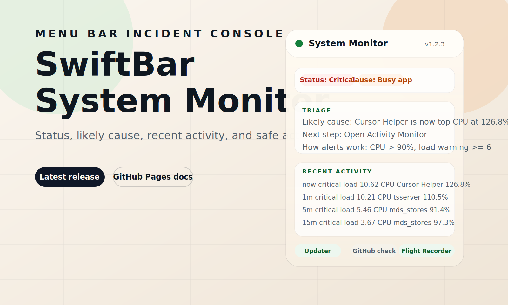

# SwiftBar System Monitor

[](https://github.com/oleg-koval/swiftbar-plugins/actions/workflows/ci.yml)
[](https://github.com/oleg-koval/swiftbar-plugins/actions/workflows/release.yml)
[](https://github.com/oleg-koval/swiftbar-plugins/actions/workflows/pages.yml)
[](https://github.com/oleg-koval/swiftbar-plugins/releases)
[](./LICENSE)
[](https://github.com/swiftbar/SwiftBar)
[](https://github.com/swiftbar/SwiftBar)

Open-source SwiftBar plugin for real macOS incident triage. It keeps CPU, memory pressure, disk, battery, Docker, devices, and "what changed before things got slow?" one click away from the menu bar.

Project site: [oleg-koval.github.io/swiftbar-plugins](https://oleg-koval.github.io/swiftbar-plugins/)



## Why

Most menu bar monitors stop at raw numbers. This plugin is built to answer the next question:

`What is wrong right now, what likely changed, and what should I do next?`

It combines fast health signals with process triage, safe actions, a rolling Flight Recorder history, and in-menu update support.

## Highlights

- Compact macOS health state in the menu bar with a motion-safe healthy indicator.
- Merged top-level triage block with status, likely cause, next step, alert thresholds, and recent activity.
- Full incident context from a rolling Flight Recorder stored in the plugin cache.
- Busy-app detection with fast `TERM` actions and clearly separated disruptive operations.
- Optional Docker/OrbStack details, device probes, energy impact, and system alerts.
- One-click `Update from GitHub` action with background execution, notifications, and in-menu status.
- Semantic versioned releases, changelog generation, GitHub Actions CI, and GitHub Pages documentation.

## Install

SwiftBar requirements:

- macOS with [SwiftBar](https://github.com/swiftbar/SwiftBar) installed
- built-in macOS command-line tools
- optional extras: `docker`, `osx-cpu-temp`, `istats`

Install SwiftBar:

```sh
brew install swiftbar
```

Install the plugin:

1. Clone this repository, or download `system-monitor.5s.sh` from the latest release.
2. If you cloned the repo, set SwiftBar's plugin folder to [`swiftbar/`](/Users/olegkoval/projects/personal/active/swiftbar-plugins/swiftbar), not the repo root.
3. If you downloaded only the script, drop `system-monitor.5s.sh` into your existing SwiftBar plugin folder.
4. Make the plugin executable if needed:

```sh
chmod +x system-monitor.5s.sh
```

5. Refresh SwiftBar:

```sh
open -g "swiftbar://refreshplugin?plugin=system-monitor.5s.sh"
```

Why the `swiftbar/` subfolder:

- SwiftBar scans plugin folders recursively and the folder picker warns on large working trees.
- A development checkout often contains `node_modules`, build output, and docs that make the repo root noisy.
- The [`swiftbar/`](/Users/olegkoval/projects/personal/active/swiftbar-plugins/swiftbar) folder contains only the plugin entrypoint, while self-update still targets the real repository checkout.

## Update Path

Use `Actions > About > Update from GitHub`.

The plugin supports two installation modes:

- official checkout or repo subfolder install: runs `git pull --ff-only`
- copied plugin file: downloads the latest `system-monitor.5s.sh` from GitHub and replaces the local file

The update runs in the background and reports result status in the menu plus a macOS notification.

## Configuration

Supported config sources, in precedence order:

1. SwiftBar environment variables
2. `$SWIFTBAR_PLUGIN_DATA_PATH/config`
3. `~/.config/swiftbar-system-monitor/config`
4. script defaults

Example config:

```sh
SM_LOAD_WARN=6
SM_LOAD_CRIT=8
SM_HIGH_CPU_THRESHOLD=90
SM_LOW_DISK_WARN_GB=20
SM_SHOW_DOCKER=true
SM_SHOW_DOCKER_STATS=false
SM_SHOW_DEVICES=false
SM_SHOW_SYSTEM_ALERTS=true
SM_SHOW_ENERGY=false
SM_ANIMATE_TITLE=true
SM_SLOW_CACHE_TTL_SECONDS=300
```

SwiftBar variables use the `VAR_` prefix:

| Variable | Default | Purpose |
| --- | ---: | --- |
| `VAR_SM_LOAD_WARN` | `6` | Load average warning threshold |
| `VAR_SM_LOAD_CRIT` | `8` | Load average critical threshold |
| `VAR_SM_HIGH_CPU_THRESHOLD` | `90` | CPU percent treated as runaway |
| `VAR_SM_LOW_DISK_WARN_GB` | `20` | Free disk warning threshold |
| `VAR_SM_SHOW_DEVICES` | `false` | Enable cached display, USB, Bluetooth, and network detail |
| `VAR_SM_SHOW_SYSTEM_ALERTS` | `true` | Show update, iCloud, and Spotlight alerts |
| `VAR_SM_CHECK_SOFTWARE_UPDATES` | `false` | Enable the slower macOS update scan |
| `VAR_SM_SHOW_DOCKER` | `true` | Show Docker or OrbStack section when available |
| `VAR_SM_SHOW_DOCKER_STATS` | `false` | Run `docker stats` for per-container CPU and memory |
| `VAR_SM_SHOW_ENERGY` | `false` | Show energy impact while on battery |
| `VAR_SM_ANIMATE_TITLE` | `true` | Animate the healthy menu bar indicator |
| `VAR_SM_SLOW_CACHE_TTL_SECONDS` | `300` | Cache TTL for slower probes |

## Development

Core checks:

```sh
bash .repo/scripts/verify
```

Repo tooling:

```sh
npm ci
npm run site:build
npm run release:dry-run
```

The verify script covers:

- Bash syntax
- ShellCheck for the plugin, tests, and helper script
- smoke rendering
- shell-based regression tests

## Release Model

Releases are automated with `semantic-release` on `main`.

- `fix:` -> patch release
- `feat:` -> minor release
- `perf:` -> patch release
- `!` or `BREAKING CHANGE:` -> major release

Each release:

- updates `CHANGELOG.md`
- syncs the version in SwiftBar metadata and `PLUGIN_VERSION`
- creates a GitHub release
- attaches the plugin script as a release asset

Commit and release rules are documented in [docs/releasing.md](./docs/releasing.md).

## SwiftBar Plugin Standards

This repository intentionally follows the SwiftBar plugin conventions:

- plugin filename carries the refresh schedule: `system-monitor.5s.sh`
- xbar metadata is embedded in the script header
- plugin output uses a header/body split via `---`
- menu actions use `bash="..."` with `terminal=false` for non-interactive background work
- the install-facing [`swiftbar/`](/Users/olegkoval/projects/personal/active/swiftbar-plugins/swiftbar) folder stays small even when the repo checkout contains development tooling
- helper files stay out of SwiftBar import paths through `.swiftbarignore`

Implementation notes live in [docs/plugin-development.md](./docs/plugin-development.md).

## Contributing

Start with [CONTRIBUTING.md](./CONTRIBUTING.md).

Public repo standards included here:

- issue forms
- PR template
- CODEOWNERS
- security policy
- code of conduct
- dependency update automation

## License

MIT. See [LICENSE](./LICENSE).
